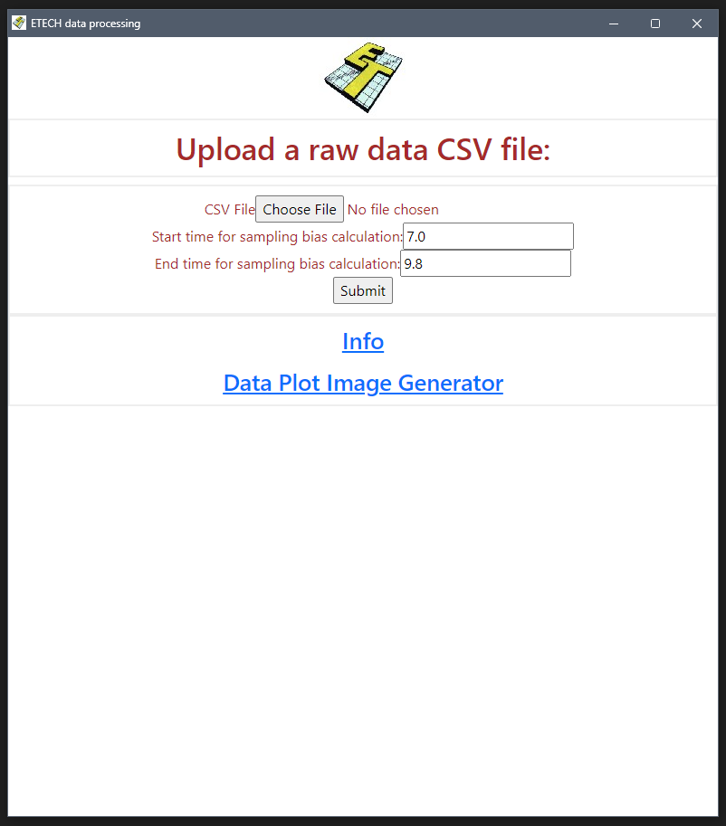

# README

## ETECH data processing and image processing app

 

### 1. Data Processing

#### Inputs

The data processing application will take the raw data .csv typcially named `315-004.csv` that comes from DTS.

The data procssing application will need the following user input 
* the `start time` for the window that we expect the Roll, Pitch and Yaw **rates** to be zero (default 7 sec)
* the `end time` for the window that we expect the Roll, Pitch and Yaw **rates** to be zero (default 9.8 sec)
This time window will be used to subtract the sampling bias from the Roll Pitch and Yaw **rates**

#### Outputs

The application will calculate and display:
* the speed (in km/h) if the leading edge is aligned
* the speed (in km/h) if the trailing edge is aligned
* the sampling bias that was calculated and removed from the Roll, Pitch and Yaw **rates**

The application will also generate and display 3 plots to validate the calculations:
* plot 1 is the first square pulse from the speed sensor and the second square pulse from the speed sensor with the leading edges aligned.
* plot 2 is the four peaks representing the start and end of the first and second square pulse. 
* plot 3 is the roll, pitch, and yaw **rate** data to validate the time window selected by the user.

### 2. Image Processing

#### Inputs

After the data is processed through TRAP, there should be the following files 
* X-Accel.csv 
* Y-Accel.csv 
* Z-Accel.csv 
* RollPitchYaw-Angles.csv
* ASI.csv (only for EN1317 tests)

The image procssing application needs all of these .csv files to run.
Additionally, the user will input 
* the `time of OIV` that is calculated by TRAP
* the `final time` that the data animation should go to (typically <= 0.5 seconds)
* the `frame rate` of the high speed camera video (typically 1000 fps)

#### Outputs

The application will generate a .png file for each camera frame up to the `final time` indicated, starting from 10 ms before impact.
The .png files will be zipped together and available to download/save after the processing is complete.
Except the processing to take about 100 seconds if the `final time` is 0.5 seconds.

### Installation and Use

to run
